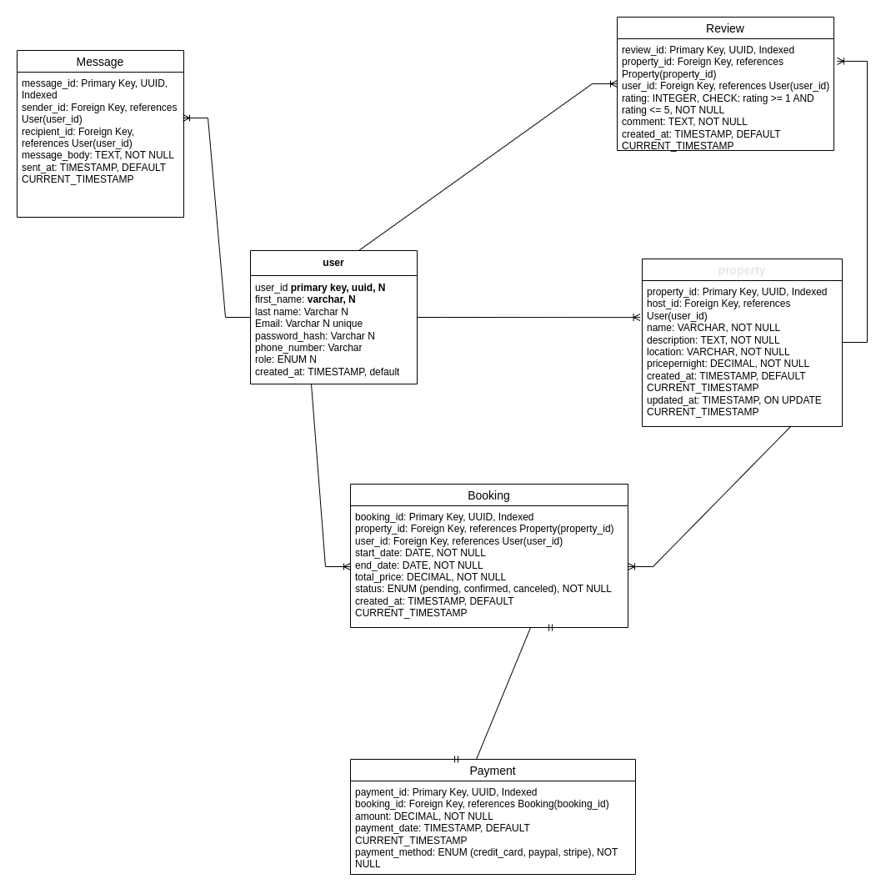

# Relationships between Entities
*** 

1. ## User to Property

## Relationship: One-to-Many

A user (host) can list multiple properties, but each property is owned by one user.

2. ## User to Booking

## Relationship: One-to-Many

A user (guest) can make multiple bookings, but each booking is made by one user.

3. ## Property to Booking

## Relationship: One-to-Many

A property can have multiple bookings, but each booking is for one property.

4. ## Booking to Payment

## Relationship: One-to-One

Each booking is associated with one payment, and each payment is for one booking.

5. ## Property to Review

## Relationship: One-to-Many

A property can have multiple reviews, but each review is for one property.

6. ## User to Review

## Relationship: One-to-Many

A user (guest) can write multiple reviews, but each review is written by one user.

7. ## User to Message

## Relationship: One-to-Many (from both sender and recipient perspectives)

A user can send and receive multiple messages, but each message has one sender and one recipient.